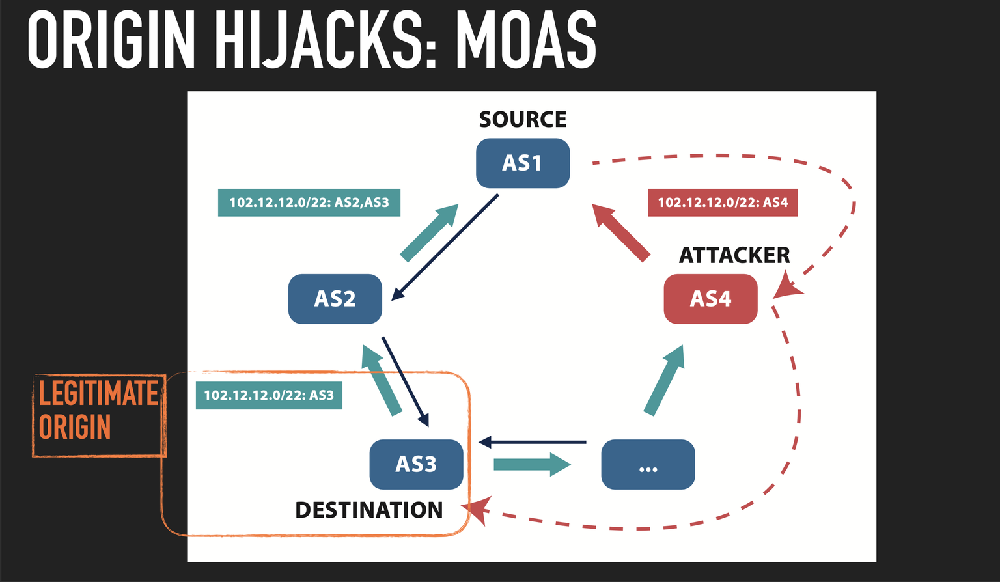
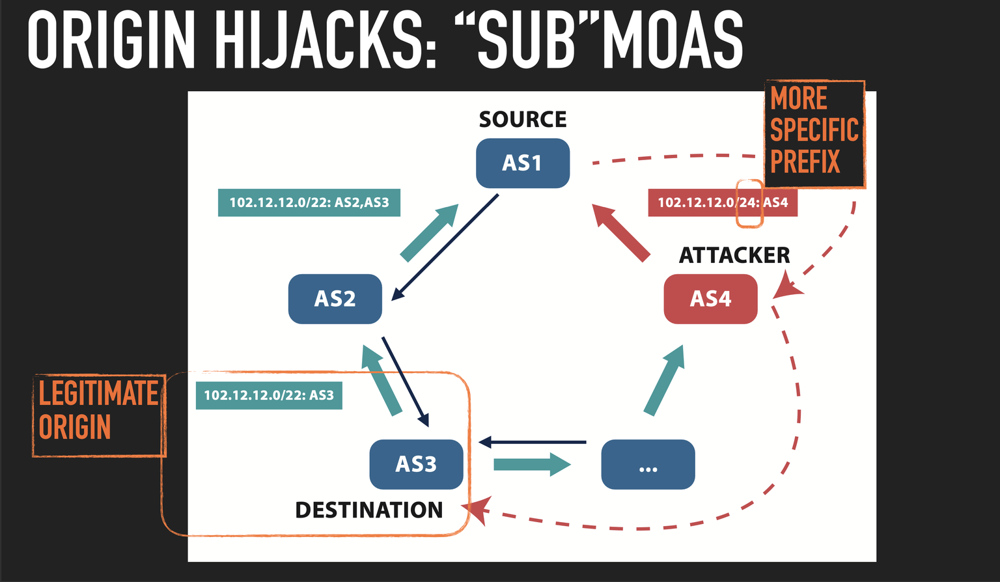
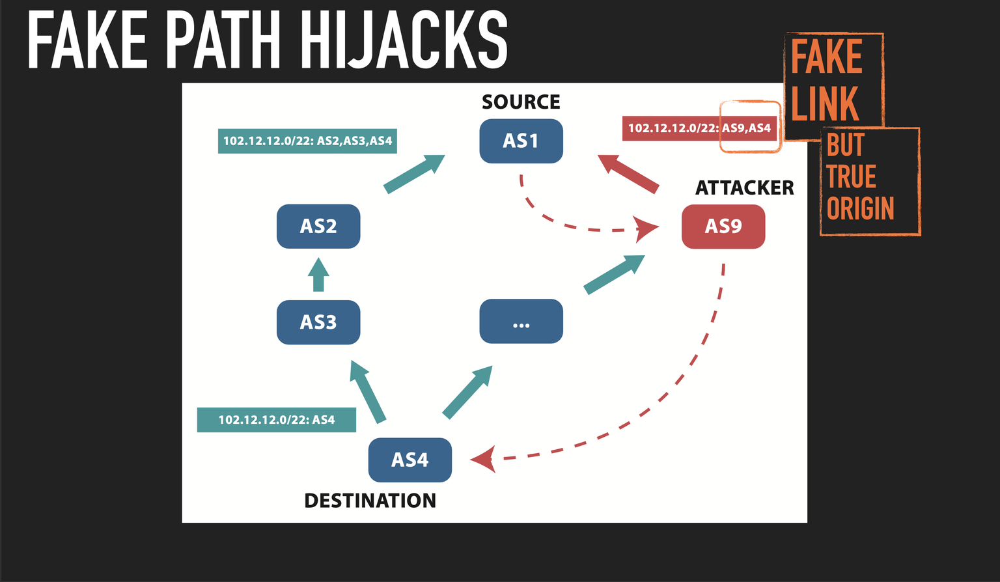
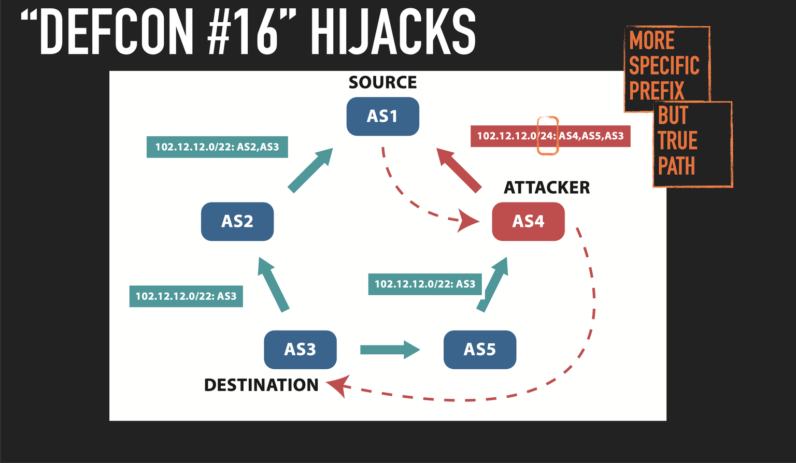
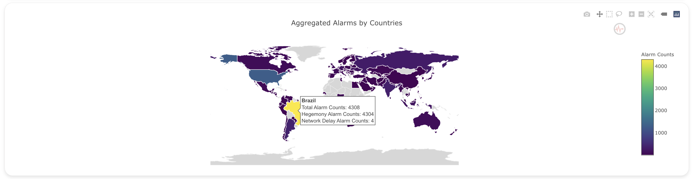
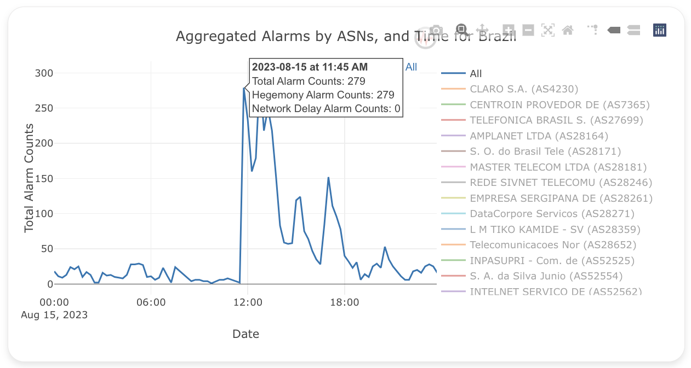
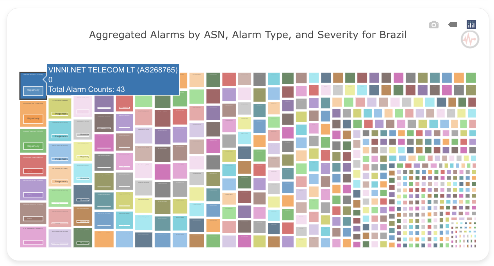

# GSoC Final Report - Mohamed Awnallah
##### Organization: Internet Health Report (IHR)
##### Project: Alarms correlation and aggregated reports (online tool) IHR Project
##### Project Link: https://summerofcode.withgoogle.com/programs/2023/projects/u7Y9S6sc
##### Student: Mohamed Awnallah
##### Mentors: Romain Fontugne, Emile Aben

### Project Demo
Here is a demo of the dashboard functionality I developed from scratch in this GSoC project:

### Introduction
I want to introduce my Google Summer of Code Project at the Internet Health Report (IHR), which focused on Alarms Correlation and Aggregated Reports through an online tool. This project is being conducted under the mentorship of Romain Fontugne and Emile Aben.

In today's rapidly evolving Internet infrastructure, effective monitoring of Internet alarms related to BGP Hijacking, BGP Routing, Internet Delays, and Outages is not just essential, but critical. This project was initiated to address this crucial need, offering an array of benefits.

#### Improved Network Monitoring
With the comprehensive correlation and aggregation of alarm data, our project significantly enhances the capability to monitor the health and performance of Internet networks. This translates to quicker issue detection, prompt response, and minimized downtime.

##### Enhanced Situational Awareness
By collating alarms from diverse sources and visualizing them in coherent ways, our project augments the understanding of the overall Internet ecosystem. This heightened awareness empowers network administrators, policymakers, and stakeholders to grasp the landscape's dynamics more comprehensively.

##### Better Decision-Making
The availability of consolidated and correlated alarm data equips decision-makers with more accurate and up-to-date information. In turn, this leads to informed decisions that can be swiftly implemented, ensuring network stability and minimizing potential risks.

##### Improved Collaboration
The shared platform for alarm correlation and aggregated reports facilitates collaboration among various stakeholders. Network operators, analysts, policymakers, and researchers can all access the same comprehensive data pool, fostering cooperation, problem-solving, and the exchange of insights.

### Inside the project
Our project successfully achieved its objective by aggregating and correlating data from multiple sources, including [IHR](https://ihr.iijlab.net/ihr/en-us), [Global Routing Intelligence Platform (GRIP)](https://grip.inetintel.cc.gatech.edu/), and [Internet Outage Detection and Analysis (IODA)](https://ioda.inetintel.cc.gatech.edu/dashboard). Subsequently, we employed three visualization methods – World Map, Time Series, and TreeMap – to present the insights. These visualizations provide diverse levels of granularity, encompassing Country and Autonomous System Entities, along with Date Time Filtering.

#### IHR Alarms
IHR is dedicated to monitoring the condition of Internet networks. It facilitates better comprehension of Internet infrastructure for network operators, policymakers, and stakeholders. The following alarms are used in IHR:

- **Hegemony Alarms:** These measure AS dependency using BGP data.
- **Network Delay Alarms:** These monitor latencies via traceroutes from the RIPE Atlas measurement platform.

#### GRIP Alarms
GRIP is focused on BGP Hijacking Observability, involving near-real-time monitoring and analysis of suspicious BGP routing events to identify and mitigate hijacking attempts. It encompasses these BGP hijack alarms:
- **MOAS (Multiple Origin Autonomous System):** A single AS originates a BGP route for IP prefixes belonging to other ASes.

- **Sub-MOAS:** A specific type of hijack where an AS originates BGP routes for more specific prefixes within a larger IP prefix belonging to another AS.

- **New Edge BGP Hijack:** Also known as Fixed AS Path BGP Hijack, it employs a fake link with a true origin.

- **Defcon:** Involves targeting a more specific IP address prefix and using a true AS path for a seemingly legitimate attack.

#### IODA Alarms
IODA is a 24/7 Internet monitoring tool for detecting and visualizing large connectivity issues in real-time. It raises the following alarms:
- **BGP:** Gathers BGP data by processing updates from Route Views and RIPE RIS collectors.
- **Active Probing (Ping-Slash24):** Monitors subnet health by sending ICMP echo requests to all IP addresses within a specific subnet (usually a /24 subnet). IODA uses a custom implementation of the [Trinocular technique](https://www.isi.edu/~johnh/PAPERS/Quan13c.html).
- **Network Telescope:** Observes Internet events targeting unused address space, aiding in detecting possible network attacks. The basic idea is to observe traffic targeting the dark (unused) address space of the network. Since all traffic to these addresses is suspicious, one can gain information about possible network attacks. IODA analyses the traffic data from both the University of California, San Diego (UCSD) and Michigan Educational Research Information Triad (MERIT) Network Telescopes.

### Real-World Use Case
Our project's practicality is highlighted by recent events. On August 15, 2023, at 11:30 UTC, Brazil experienced Internet outages due to a power cut. Our project detected these outages through analysis of Hegemony Alarms, as depicted below:
- The World Map shows how many alarms happened only in Brazil on August 15, 2023.

- The Time Series shows the large spike of alarms when a power outage occurred.

- The TreeMap shows the details of ASNs that are impacted by the power outage.

### Expanding the Project
Feedback from users and stakeholders is invaluable for refining and expanding this project. The code for this project is open source, fostering a collaborative environment for further development and innovation. Gathering insights from network administrators, policymakers, and analysts will aid in enhancing the alarms correlation and aggregated reports tool.

Although all the requirements of this project as outlined in the GSoC proposal have been completed, this project represents a new feature of having a dedicated table that displays all filtered alarms. This feature would provide a more convenient way to view the details of alarms that you find interesting. This enhancement would be a focal point for version 2 of the project.

Future iterations could involve incorporating additional data sources to enhance the scope and accuracy of alarms. For instance, potential data sources could include DNS query data to monitor DNS-related anomalies and HTTP request data to detect website availability issues. The open-source nature of the project welcomes contributions and suggestions for integrating new data sources.

Additionally, future developments should also focus on refining visualization techniques to provide even more actionable insights at a glance. We believe that an open approach to development will pave the way for a more comprehensive and impactful tool.

Feel free to suggest any potential data sources you have in mind. It's worth noting that there's existing documentation on how to incorporate new data sources into the project, available in the IHR GitHub repository. Your input regarding possible data sources is highly appreciated, and we look forward to collaborating on the evolution of this project.

### Link to work
* [Link to dedicated branch](https://github.com/InternetHealthReport/ihr-website/tree/alarm-corr-aggr)
* [Links for all commits](https://github.com/InternetHealthReport/ihr-website/pulls?q=is%3Apr%20author%3Amohamedawnallah%20project%3Ainternethealthreport%2F6)

### Discussions
[Our GitHub Discussions about the project](https://github.com/orgs/InternetHealthReport/discussions/categories/gsoc23-alarms-correlation-and-aggregated-reports-online-tool?discussions_q=category%3A%22GSoC23%3A+Alarms+correlation+and+aggregated+reports+%28online+tool%29%22+)

### More granular contributions
[More granular contributions based on iterations and sprints](https://github.com/orgs/InternetHealthReport/projects/6)
